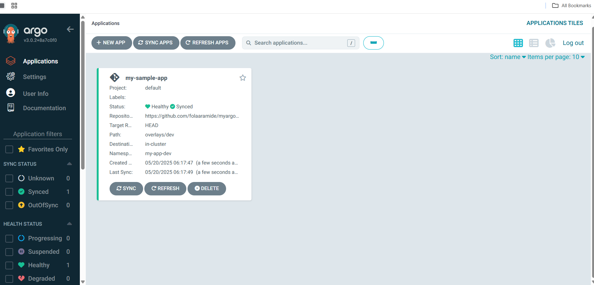
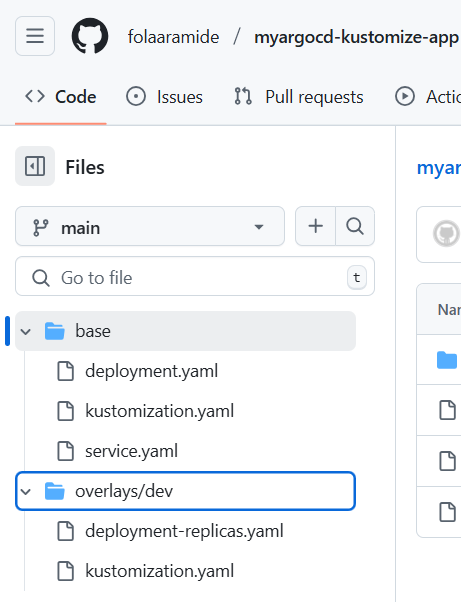

# 🚀 GitOps CI/CD with ArgoCD, Kubernetes & GitHub

As a **Cloud and DevOps enthusiast**, I built a hands-on project implementing a **declarative GitOps-based CI/CD pipeline** using **ArgoCD**, **Kubernetes**, and **GitHub**.

This project automates deployment workflows and maintains state consistency across Kubernetes environments using GitOps principles.

## 🎯 Project Objective

Deploy a web application to a Kubernetes cluster with **ArgoCD** managing the application state declaratively and automatically from a **GitHub** repository. The process is:

- Automated  
- Secure  
- Observable  

## 🧭 Project Architecture

GitHub Repo (App Manifests) - > ArgoCD (in K8s) - > Kubernetes Cluster (App Deployed via Sync)

## 🛠️ Tools & Technologies
Kubernetes (minikube or kubeadm)

ArgoCD (GitOps CD tool)

Kustomize (for overlays)

YAML, Git CLI, ArgoCD CLI

GitHub (source of truth for manifests)

NodePort (for ArgoCD Dashboard exposure)

## ⚙️ Setup Instructions
1. Install kubeadm-based Kubernetes Cluster

2. Install ArgoCD in Kubernetes
kubectl create namespace argocd
kubectl apply -n argocd -f https://raw.githubusercontent.com/argoproj/argo-cd/stable/manifests/install.yaml

3. Expose ArgoCD Dashboard
kubectl patch svc argocd-server -n argocd -p '{"spec": {"type": "NodePort"}}'

Access the dashboard:
http://<NodeIP>:<NodePort>

4. Install ArgoCD CLI
Download CLI

Login via CLI:
argocd login <ARGOCD_SERVER>

5. Deploy the Application

Option A: Using CLI

argocd app create my-web-app \
  --repo https://github.com/yourusername/your-repo.git \
  --path overlays/dev \
  --dest-server https://kubernetes.default.svc \
  --dest-namespace default
argocd app sync my-web-app

Option B: Using ArgoCD Dashboard

Go to GUI

Click "NEW APP"

Fill in app name, repo, path, etc.

Click Create and Sync

6. Access the Deployed Application

Expose the app service via NodePort or LoadBalancer:

kubectl get svc

Visit:
http://<NodeIP>:<AppNodePort>

7. Real-Time Updates & Sync
Edit YAML (e.g., replica count)

Commit & push to GitHub

ArgoCD auto-syncs & updates the app live

Embed in README like:

### ArgoCD Dashboard

### Application Structure in GitHub

### Live Web App

## ✅ Outcomes Demonstrated
GitOps-based deployment strategy

Environment separation with overlays

Declarative state management

Secure CLI and GUI access

Auto-sync and real-time updates

Dashboard monitoring

## 📚 Learnings
This project reinforced my understanding of:

Kubernetes application lifecycles

GitOps workflows using ArgoCD

Infrastructure as Code and declarative configurations

Secure and observable CI/CD pipelines

